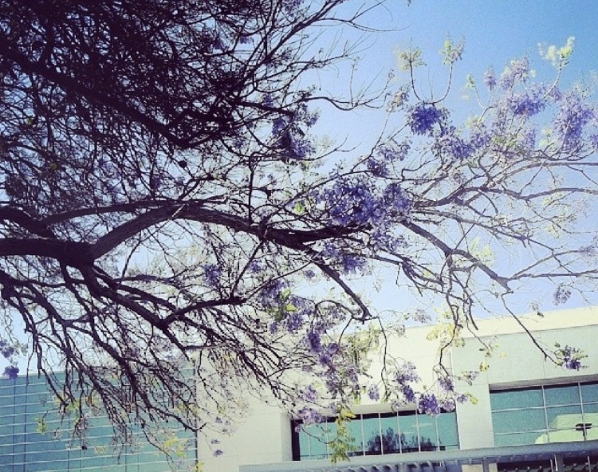
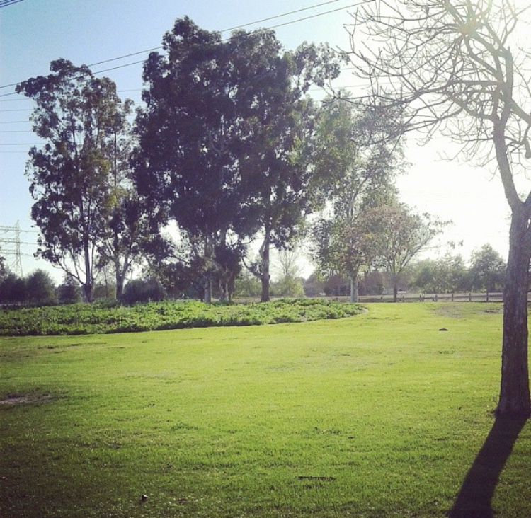

## Gardening Journal

I'm very new to gardening. But, one doesn't have to be a musician to appreaciate music. My interest was sparked by [The Frustrated Gardener,](https://frustratedgardener.com/) specifically his garden diaries. Now, I am determined to build up my knowledge on plants to have a garden of my own. 

### My favorites
 

Personally, flowers get to much credit. They are pretty, but they always overshadow the leaves of plants which can be so unexpectedly cool. For example, eucalyptus leaves are small dainty and cute while the purple velvet plant is bright and fun. 

### My Planter list: Plants I wish to grow
- Radishes
- Mint
- Marigolds

Slowly, but surely ;)

